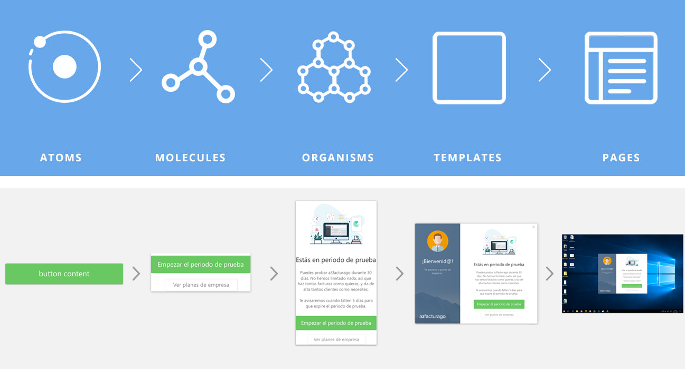
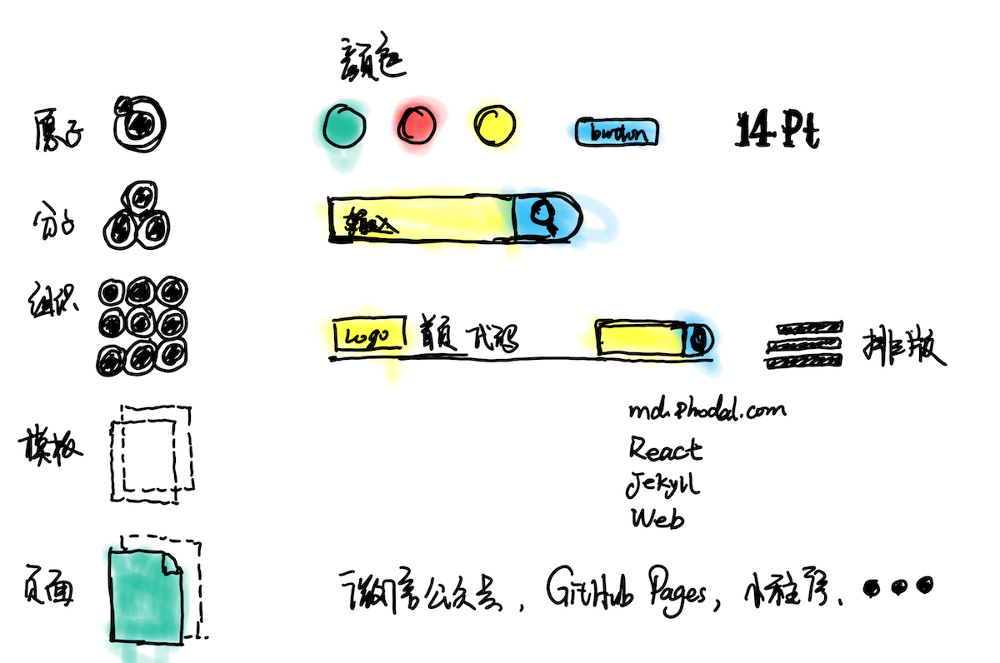
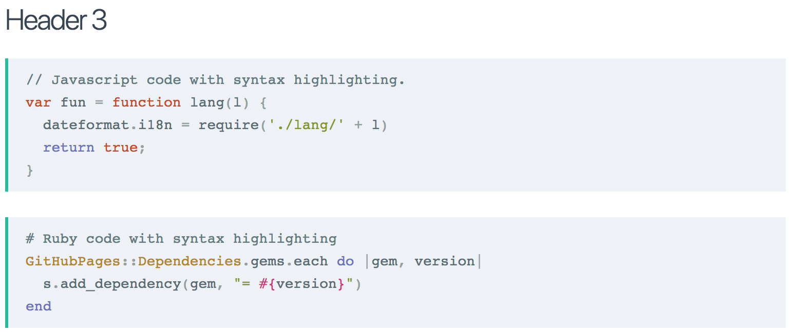

Mifa Design：一个服务于 Markdown 的设计体系
===

嗯，UI 框架，这已经不是一个很好的时代了。可对于 Design Systems 来说，**这还是个不错的开始**。

Material Design 是 Google 推出的专为设计适用于多个平台和设备的视觉、运动与互动效果而制定的综合指南。它不仅让 Web 应用与 Android 原生应用、Chrome OS 应用等等有了一致的外观效果，它还能提高一个一致的视觉体验。

Ant Design 是一个服务于企业级产品的设计体系。基于『确定』和『自然』的设计价值观，通过模块化的解决方案，让设计者专注于更好的用户体验。

那么 Mifa Design 呢？

> Mifa Design 是一个服务于个人的设计体系。基于『易读性』 和『一致化』 的设计价值观，让 Markdown 作者能专注于写作。

我已经编不下去了，就三个字母


Mifa 之所以称为 Mifa Design，只是因为它的缩写是 MD。并不是为了和 Ant Design 齐名，只是用于为我的网站、博客、APP、小程序等等，提供一个一致化的 UI 及阅读体验。


（PS：Logo 有待改进进进进进进进进进进进进进进进）

缘由
---

过去，在讨论程序员影响力的时候，我们讨论了 Avatar、ID 一致性带来的影响。今天，一致性不仅仅只体现在 ID 和头像上，还有 UI 设计上。

在这几年里，在业余时间创作了一系列的作品——文章、开源软件、开源应用、电子书等等。按统计来看，每天累计大概会有两千多用户，会接触到我的博客（~500），Growth 系列应用（~200），玩点什么网站、小程序、APP（~200），开源电子书（~800），还有 GitHub 上的一系列开源应用的文档。而这没有算上在 微信公众号、GitHub、知乎、SegmentFault、CSDN 等等的访问量，还有在今日头条、微博、搜狐、百家号会自动转载文章。

考虑到这么大的访问量里，如果一致化设计风格，那么将会提升我的设计能力。于是，我制作了几个简单的计划，罗列了一下可以修改 UI 的地方：

 - GitHub Pages 主题（完成）
 - 微信公众号编辑器（完成）
 - 在线电子书（TBC）
 - 我的博客 phodal.com（TBC）
 - 玩点什么网站、小程序、APP（TBC）

因为这些地方多数都是 Markdown 编写的，并且共同组成了一个设计体系。因此，名称就由 Mifa Framework 变成了 Mifa Design。Design 出自于之前项目上 UX 分享的 Design System 的 session：



因为，他们解决的是同一个问题，一致性。Design System 要解决的是一定规模公司中的 UI 设计问题，Mifa Design 则是为了提供一致化的阅读体验。



考虑到原子设计是一个不错的处理流程，接下来的内容就以原子设计来展开。

> 原子设计由原子、分子、生物体、模板和页面共同协作以创造出更有效的用户界面系统的一种设计方法。

原子：Mifa CSS Framework
---

原子，即是**事物的基本组成部分**。它是最小的单元，不能再往下细分，也就是基本的 HTML 标签，诸如表单标签，输入，按钮。

最初在设计 Mifa 的时候，我只需要定制一个方便阅读的 CSS 样式。

对于一篇文章（Markdown）来说，需要个性化的东西有：**标题**、**引用**、**段落**、**列表**、**表格**、**代码**、**链接**。而这已经基本上包含了一个**基础**的 CSS 框架，所需要的几个重要的基本要素。在那之上，我们可能还需要诸如网格、按钮、表单等元素。

上面的这些元素，都对应了 HTML 标题：h1~h6、blockquote、p、list、table、pre、code、a，以及 button, form，还有一个额外的 grid。

对于我而言，我需要自定义下面的几个基本要素即可：

 - 颜色，定义了一个网站的基本风格
 - 字体大小，影响了用户的阅读体验
 - 文本风格，诸如行高、段落间距、语法高亮等等的内容。

接着我找到了一个迷你的 CSS 框架 ``milligram``。

随后，在上面加上了我之前作品的颜色，如玩点什么的深灰色，Growth 中采用的绿色。并采用电子书及玩点什么的 Markdown 字体大小，及颜色来提供更好的阅读体验。

分子：可复用组件
---

分子，即由原子聚合而成的粒子。

在 UI 设计中，分子是由几个基本的 HTML 标签组成的简单组织。例如，在一个搜索元素中，它是由标签原子、输入原子和搜索原子组成：


又比如语法高亮，则是要基本的 ``code`` 标签，加上一系列的 HTML 元素组成：



他们是一系列的可复用组件，可以组成更强大的有机体

有机体（组织）：组件
---

> 有机体是由分子或原子或其它有机体组成的相对复杂的 UI 组分 。

它用于创建一些独立、可复用的内容，诸如 header：


又比如 footer：


这是界面中，相对复杂的不同区块。

模板：Mifa Jekyll 主题及 Markdown 编辑器
---

模板，顾名思义就是整合前面的元素，构建整体的布局。

诸如一个博客包含了 header、footer 及博客本身的内部：


诸如基于 Mifa 的 GitHub Pages Jekyll 主题也是模板，只需要：

在项目中创建 ``_config.yml`` 文化，在文件中写入：

```
remote_theme: phodal/mifa-jekyll
```

即可。这里的 Jekyll 即是模板。

而我的微信编辑器，本身也是基于此模板的，访问地址：[md.phodal.com](md.phodal.com)。

页面
---

So，本文自豪地采用 Mifa Design 0.1.0 排版。
