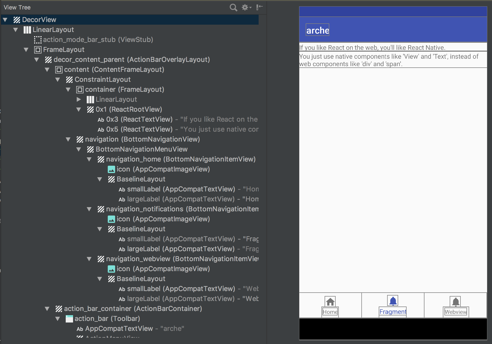
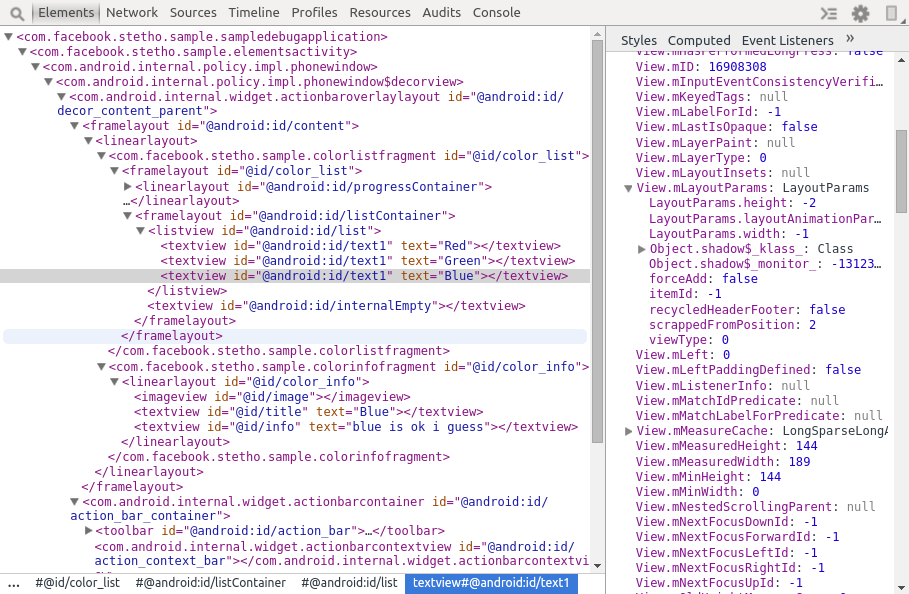

一个前端程序员的一个月原生 Android 开发体验
===

> 自从我写了 Android 应用后，上知乎的时间变得更长了。

自从我写了 Android 应用后，上知乎的时间变得更长了。哦，不对，你理解错了，我的意思是：编译代码、打包 APK、运行在设备上需要时间。可不像前端，一保存代码，就自动刷新页面。

是的，从上上周一开始，因为项目缺人的原因，作为一个有 Java 开发经验的大前端，我又又双叕进入了原生 Android 开发的世界。

这一个月下来，也算是有一些写 XML 的心得吧——不对，写 Java 代码，看 Kotlin 代码的心得。

 - UI 布局
 - MVC 的 Model
 - 静态类型
 - 类与面向对象
 - 最大的问题：Android 机制

UI 布局
---

混合应用说到底还是 HTML + CSS，这些东西基本上是没有多大变化的。无非就是使用一下 Ionic 这样的框架，使 UI 看上去和原生移动应用的风格一致；与些同时，再想方设法调用一些原生的功能，来实现与原生应用一样的体验。

使用 XML 切图并不是一件容易的事，

还有已经有写 React Native 布局的一些经验，在写起 Android 的布局，倒也还好——没有那么坑。



Android 中也有类似于 JavaScript 生成 HTML 的方式，自定义模板。

通过 stetho 也可以做与 Web 相关的调试工作：



又比如网络上的：


但是依赖上比较大，我还是更习惯 Charles。

HTML + CSS 在编写 UI 的时候，有各种奇技淫巧，比如说样式的优先级

每个 Activity（页面）都是

SVG -> Vector 矢量图形

Model 校验
---

默认对 Model 进行校验，算是与前端的一个大的区别。为了取出一个 JSON 中的某个值，可以直接使用 Retrofit 库来转换数据，又或者用 GJSON 转换成某种对象，而在前端里，这种事情是轻而易举的，我万能的 ``JSON.parse``。

因此在使用 JavaScript 编写的时候，我们通常不会对 Model 进行校验。这主要是利益于动态语言的优势。

与没有对象校验的前端相比，一旦出错，根本不容易察觉。这一点，或者也是一个优势所在——当你上架了新版本的 API 时，旧的应用不会 NullPointerException。与此同时，在开发的时候，后台 API 发生变化的时候，也会导致后续的一系列 bug。

而在静态语言中，要这么就反而就容易导致各种问题。

按照 Google 推荐的 Android 架构，Model 的来源可以是远程数据或者本地的数据。

静态类型
---

与上面相类似的是，

怪不得 Android 的程序员喜欢上了 Kotlin：

```kotlin
override fun onCreateView(inflater: LayoutInflater?, container: ViewGroup?, savedInstanceState: Bundle?): View? {
    val view = inflater?.inflate(R.layout.fragment_home, container, false)
    val button: Button = view!!.findViewById(R.id.open_rn_button)
    button.setOnClickListener(this)
    return view
}
```

由于没有经验，我经常把 ``val`` 写成了 ``var``。

这就和那些习惯写 alloc init 的 iOS 程序员，一夜间突然喜欢上了写 ES6 一样：

```swift
let className = NSStringFromClass(MyClass)
 let classType = NSClassFromString(className) as? MyClass.Type
 if let type = classType {
   let my = type.init()
 }
```

哦，不对 他们写的是 Swift。

类与面向对象
---

又回到设计模式的天下，

大量的代码，就意味着很容易出现重复。

Android 机制
---

最后，又难免回到了 Android 系统的一些机制。这一点与我们讨论的各种浏览器特性是相似的

最典型的例子就是生命周期，在编写应用的过程中，得时时刻刻关注着生命周期上的变化。这一点和 React、Vue 都是蛮相似的。

