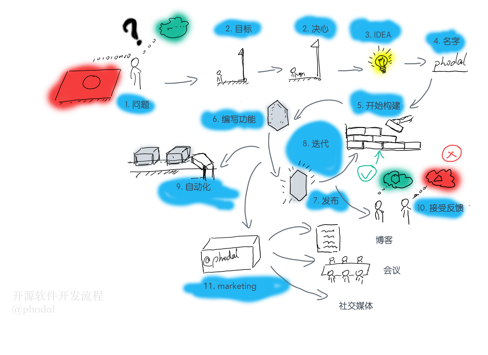

开源的是产品，而不只是代码：开源不是一件简单的事情
===

你是否也想拥有一个可以写在简历上的开源作品？你是否也想创建一个 star 过千的项目？

写了那么多开源的软件，分享了一系列的 star，总得分享一下如何去做这样的事件。

> 授人以鱼不如授人以渔。

开源是一种社区行为
---

开源，英语源自 Open Source，意指开放源码。而依我看来：开源不仅仅只是开放源码，它是一种社区行为，不是靠单一的编码能力、算法优势，又或者谁的代码写得好。开源是一种包含源码的产品，而不仅仅局限于代码，它还包含有软件背后的行为。一个优秀的开源软件，需要由一系列的因素构建，除了代码之后，有易用性、上手速度、文档丰富度、问题响应速度、接受反馈水平的等等。

 - 易用性
 - 上手速度
 - 文档丰富度
 - 问题响应速度
 - 接受反馈水平
 - 社区推广

典型的错误开源方式，在大的厂商里，有阿里为例。过去的阿里，通常就是将一个内部的开源软件开源出来，或者直接开源捐赠给 Apache 基金会。这实则算不上是真正的开源，开源不仅仅意味着开放源代码，还有源码中的思想、代码中的坑、使用方式、文档等等。

我们在这里谈论的开源，**指的不仅仅是开放软件的源码，还有其相应的生态。** 一个有一定用户的软件，就意味着它不仅仅只是一个软件。

常见的开源策略
---

Facebook -> 你用了我的东西，成为了贡献者，我招你。

开源协议的选择
---

MIT, Apache


黑客工坊揭密：原来他们是这样制作开源软件的
====

> 近几年来，市面上流行的开源软件越来越多，有的触目惊心，有的改动了世界，有的震惊了国家。在这些黑客工坊里，人们究竟是怎么制作出来的？

近几年来，市面上流行的开源软件越来越多，有的触目惊心，有的改动了世界，有的震惊了国家。在这些黑客工坊里，人们究竟是怎么制作出来的？

在这些黑客工坊里，有的做出来的软件很好很流行；有的做出来则很一般但是却也很流行；有的则做出来的很好但是不流行。这究竟是为什么呢？

让我们来一探究竟。

在过去的几年里，我开始活跃在开源社区 GitHub，从默默无闻到 GitHub 国内前 10[^github]（粉丝数、star 数及提交次数居在前 10）。这样一小结，我总算是有资格来写一系列文章，以分享一下开源世界的那些事儿。写了那么多开源的软件，分享了一系列的 star，总得分享一下如何去做这样的事件。

> 授人以鱼不如授人以渔。

在这篇文章里，我将揭密开源软件的制作流程，中间会插入丰富的示例。考虑到这个过程的复杂性，同时为了让读者能对这个过程一目了然。笔者花了半天，画了一张通俗易懂地开发流程图：



即下面的 11 个步骤：

0. 问题。
1. 目标。制定出一个 SMART 的目标
2. 想法。确认出需要发布的功能
3. 名字。是的，你需要一个吊炸天的名字
4. 开始构建。寻找模板创建你的 Hello, World
5. 编写功能。
6. 发布。尽早地发现 0.1.0 版本
7. 迭代。有计划的发布功能，直到它完成你想要的功能 -> 1.0.0
8. 自动化。测试，持续集成，持续发布。
9. 接受反馈。评估用户的反馈，决定是否添加为功能
10. marketing。编写文档、文章、博客，在社交媒体进行宣传

等等，真实的情况并没有这么复杂，在这里只是为了方便叙述。

Then，让我们一点点地脱下开源的面纱。

0.问题：为什么这个软件存在着
---

有用的软件都是为了解决某些特定需求、问题而存在的。在开源软件世界里，从小至左填充一个字符串的 ``left-pad``，大到改变世界的 Linux，他们都解决了一些特定的问题。尽管有一些可能是学习而创建的，但是它解决了开发者的学习问题。

总而言之，就是软件存在的意义。

如在先前的文章《[2017 年节点——我写的那些开源软件](https://www.phodal.com/blog/summary-2017-the-opensource-software/)》总结的那样，我们想造一个轮子的来源可以是：

 - 日常工作中遇到的一些问题，提出对应的解决方案。
 - 使用某个开源软件的过程中，发现它不能满足我们的需求
 - 提取出工作上的一些好的技术实践
 - 我想开发一个工具，来帮助其它人
 - 我有一个想法，我要用它来改变世界
 - 无聊，我就是想造个轮子

接下来，让我举几个例子。

### 现在软件不能满足需求

当我在自己的项目上实施**架构决策记录**的时候，我找到了一个相关的库：adr-tools，但是发现这个库有一些小的缺点：

 - 使用 shell 编写，不易读懂、只支持类 Unix；
 - 模板里使用的是英语，不支持中文及其他语言

这种时候，一般是在项目上提个 issue，但是发现这个项目使用 shell 扩展起来不容易。因此，自己来写一个类似的软件是一种更好的选择，于是我使用 TypeScript 写了 Node.js 版的 ADR。

### 日常工作的结晶

在我们的日常、业余的开发工作中，我们往往能实施一些好的技术实践。只是受限于劳动合同的约束，我们不能直接使用这些代码来开源。但是可以独立地重新开始来造一个轮子。在一些有开源文化的公司里，便可以走开源的流程开源出来。

如我创建的 Dore，就是一个总结工作结晶的实践。它总结了我在项目上使用 React Native 实现的 WebView 容器的经验。不过，这依赖于我们对代码的抽象能力。即使，我们在项目上用了好的思想，但是并不一定能提取出来。

### 我需要一个新的工具

上面的两个例子，都需要一定的运行和抽象能力。除了自己乐意造轮子，我们还可以随意地创建一个工具，作为自己制作的工具。

如我最近写的 Solla，就是为了解决我写作的时候找图封面图的问题。

1.下定你的决心
---

我的意思是，你要下定决心去做这一件事情。因为，你很有可能半途而废，比如说我可能在上一步里，习惯了使用英语来写架构决策记录。

这是一件很难的事情，特别是当你和我一样，在 GitHub 上挖了两百多个坑位之后，你可能不会想去做这样的事件。

权衡这方面的利益不是一件容易的事情，所以不妨直接进入下一步。

2.完善关于这个软件的想法、需求
---

当我们决定创建这个开源软件的时候，我们就需要细致地想想它到底需要什么功能。它的核心功能又是什么？

在拥有对比软件的情况下，核心功能与其它软件都是差不多的。以文本编辑器为例，如果你不能提供插入图片的功能，那么有需求的用户可能就跑了。而为了吸引不同的用户，就需要一些额外的吸引人的特性。同样是文本编辑器，如果你能提供 Markdown 支持，那么你就能吸引这些用户。因此，如果是对比其它框架，那么就要完成相同的核心功能，并提供一些额外的功能。

所以，在计划的初期就要思考能提供怎样的特性。

再以架构决策记录框架 ADR 为例，那便是：

 - 采用一种通用的语言环境，如 Node.js，以支持主流的操作系统
 - 多语言支持，我的意思是它至少可以支持 English 和 中文
 - 支持状态日志查询，即我应该可以看到一个决策在生命周期里的变化
 - 一个更好的列表展示，我应该可以查看到某条决策，以及对应的最后状态、修改时间等等
 - 使用 markdown 展示，以便在 GitHub 上显示
 - 拥有一个 ToC 页面，方便用户查看

补充一点，上面有几个功能都是在实现的过程中想的，有一两个是在使用的过程中想到的。这些功能能在设计初期的时候考虑到的话，那么后期架构就不会需要需求的添加而带来开发风险。

3.取一个合适的名字
---

好了，在需求确认得差不多之后，就可以开始动手了。然后，我们就会面临一个很严峻的问题，取一个合适的名字

### 取个名字

取名，对于多数人（包含程序员）来说，是一件痛苦的事。先设想一下，我们写一个 Web 框架，我们可能需要一个能朗朗上口的名字，以 Vue、React、Angular 来看，最好是单音节、双音节、三音节。

并且，它没有被包管理工具注册过的：

 - Ruby 就查看有没有对应的 gem 名可以用。
 - Node.js 则是 npm
 - Python 便是 pip

想想，还是 Java 程序员好，这个依赖的包名是 com.phodal.xxoo，代表了这是 phodal.com 的 xxoo，而不是 hug8217.com 的 xxoo。那么，其对应的域名有可能就是 xxoo.phodal.com。

如果我们想到的名字已经被注册过了，那么这就很尴尬了。在这个时候，可以采取自己的命名规则：

我之前的命名规则：moImages、moLogs、moForms、moLe，都是以 mo 开头加一个对应用途的单词。

比如我最近的系列：dore、mifa、solla、sido，则是以唱名结合来取名字的。

### 选择合适的开源协议

取完名字之后，就需要选择一个合适的开源协议。不同的许可（协议）会赋予用户不同的权利，如 GPL 协议强制要求开源修改过源码的代码，而宽松一点的 MIT 则不会有这种要求。

更细致的协议选型，可以见我之前画的选型图：


按我的习惯，都是以 MIT 协议来发布开源软件，CC-NC 协议来发布电子书。

### 发布 0.0.1

是的，当我们取好名字，选好了协议，我们就要发布 0.0.1 版本了。

我的意思是，我们要先抢下这个名字，即占坑。在占坑前，请深思，你真的会写好这个工具吗？

比如说，我们使用 Node.js 来写一个 MQTT 的包，那么直接用 MQTT 显然更容易被搜索到：Node.js MQTT。

不行的话，只能用 Mosquitto、Mosca 这种名字了。又或者 moMQTT、iMQTT 这种加上前缀的名字，对应于 Java 平台，就可以是 jMQTT。

4.开始构建
---

如果是一个非 JavaScript 的库工具，可能就不需要了。

如果是一个 CLI（命令行）工具，也会有这样的问题。

### 选择合适的语言

选择一个合适的语言，

以 CLI 为例，面向服务器的操作系统，都安装有 Python 环境，但是可能版本不一样。有的是 2.7 的，有的版本可能是 3.4。

对于 Java 程序员来说，他们的电脑上可能没有 Node.js 环境。对于前端程序员来说，如果是 Windows 系统，那么也没有 Python 和 Ruby、Go 环境。

5.编写原型：核心功能
---

核心功能，意味着，不做过多的错误处理。

在我们日常的开发中，大概只有 20% 的代码是在核心的逻辑上，而有超过 80% 的代码是在处理错误逻辑上。所以，在那之前，请先在

6.发布
---


构建开源与构建产品是类似的，能越早推出早期版本，就越有机会赢得市场；能不断地继续接受反馈并进行改进，就越能吸引忠实用户；能做好一些市场工作，也就越吸引更多用户。

### 0.1.0 版本

先持续发布，积累功能、熟练发布流程。

比如说，你要做一个 Ruby 的 Gem 包，那么你的第一个版本是让包可以被调用。

### 0.2.0 版本

### 简化安装、使用

```
npm install -g adr
```

早先，为了支持不同的语言，还需要  ``adr init``，后来把这个步骤变成了可选，即配置了一些默认的配置。于是，用户可以直接使用 ``adr new`` 创建。

7.迭代
---

### 更新文档

在文档上，可视化用户想要的内容：

### 编写测试


### 1.0.0 版本

8.自动化
---

### 自动化测试 Travis CI

### 自动化发布

9.接受反馈
---

如果用户提了一个可怕的需求，那么

 - 要做，这个需求在考虑中
 - 做，这个需求在待办列表中
 - 不做，这个需求还需要验证
 - blablabla

总之，在看到的时候，尽可能早地去回复 。

### Pull Request

### Issues

10.marketing
---

一般来说，如果已经有了对比的框架，会写一个对比的报告。考虑到，每个框架都会各自有优势，只是优势的大和小，决定了用户量。如框架  A 容易上手，框架 B 设计思想好，那么显然框架 A 的优势更大。这样的对比可以放在 README 中，但是不提倡放在文档中。

不要撕逼 

### 文档

### 博客

### 会议

### 社交媒体


[^github]: 粉丝数按``location:china``搜索、提交数根据[http://git.io/top](http://git.io/top)计算得出、star数按[https://gitstar-ranking.com/users](https://gitstar-ranking.com/users)计算得出。

